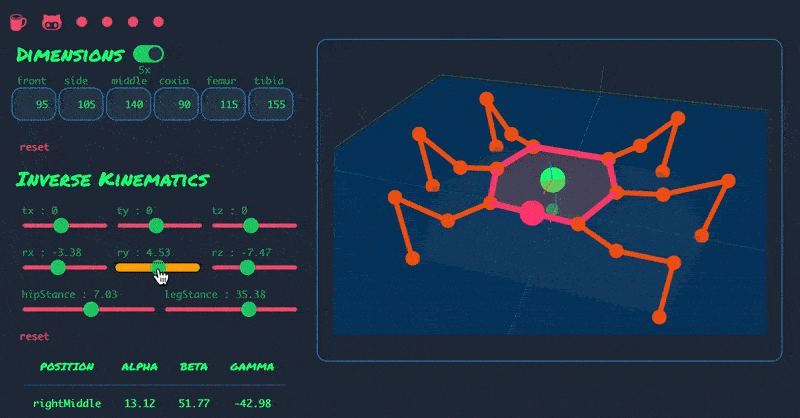

  

  <ul align="center">
    
<h1 style="display: inline-block">Hi 👋, I'm Rihaan B H</h1>

  </ul>

## ✨ About Me:
<b>🎓 Robotics and AI undergrad @Amrita Vishwa Vidyapeetham -Amritapuri Campus  💻 Member @amFOSS  🤖: Currently learning ML and DL</b>

&nbsp;

## ☎️ My Socials:

  
  

 
   

